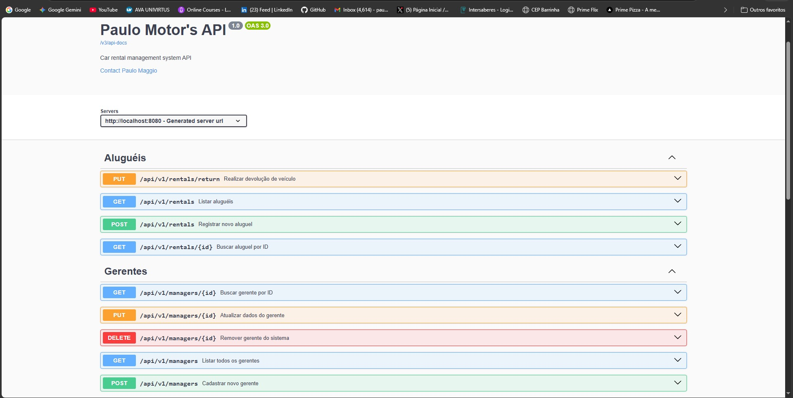

# Paulo Motor's API 🚗💨



Esta é uma API robusta de gerenciamento de locação de veículos desenvolvida para consolidar conhecimentos em segurança avançada, arquitetura REST, processamento assíncrono e boas práticas de engenharia de software utilizando o ecossistema Spring Boot.

Abaixo você encontra a documentação interativa completa gerada pelo Swagger, onde é possível visualizar a estrutura de segurança e testar os endpoints da aplicação em tempo real.

## 🎯 Foco do Projeto

O desenvolvimento desta API foi guiado pelo estudo e implementação prática de pilares fundamentais:

* **Spring Security & RBAC:** Controle de acesso baseado em funções (*Role Based Access Control*), separando rigorosamente as permissões de Gerentes (`MANAGER`) e Clientes (`CLIENT`).
* **Autenticação JWT:** Mecanismo *stateless* com tokens assinados digitalmente via algoritmo HMAC256 para garantir escalabilidade e segurança.
* **Validação de Dados:** Uso de Bean Validation (Jakarta Validation) para blindar as entradas da API e garantir a integridade antes do processamento do negócio.
* **Comunicação Assíncrona (E-mails):** Serviço integrado de notificações automatizadas para os clientes através do envio de e-mails profissionais.
* **Qualidade e Confiabilidade (Testes):** Cobertura de testes automatizados para validar fluxos críticos de locação e segurança.

## 🛠️ Tecnologias Utilizadas

* **Java 21** & **Spring Boot 3**
* **Spring Security** & **Auth0 JWT**
* **Spring Data JPA** & **PostgreSQL**
* **Spring Boot Starter Mail** (JavaMailSender)
* **SpringDoc OpenAPI** (Swagger UI)
* **JUnit 5** & **Mockito**

## 📨 Serviço de Envio de E-mails

A API conta com um microsserviço interno para notificação e confirmação de aluguéis de forma dinâmica:

* **Remetente Profissional:** Utilização de `MimeMessage` e `MimeMessageHelper` para configurar um nome de exibição customizado, evitando que o e-mail chegue mascarado ou sem identificação ao cliente.
* **Templates com Text Blocks:** Construção de corpos de e-mail limpos e organizados diretamente no código Java, injetando informações cruciais do veículo, valores calculados dinamicamente e formatação de datas locais de acordo com o fuso horário (`ZoneId`).

## 🧪 Testes Automatizados

Garantia de estabilidade e prevenção de regressões no ecossistema da aplicação:

* **Testes Unitários e de Serviço:** Implementação de cenários com `JUnit 5` e isolamento de componentes com `Mockito` para simular o comportamento de repositórios e serviços de infraestrutura externa (como o próprio disparo de e-mails).
* **Validação de Regras de Negócio:** Testes focados na consistência das locações, incluindo validação lógica de períodos de datas (retirada/devolução), cálculo correto do total de diárias e verificação estrita do status de disponibilidade do veículo (`AVAILABLE`).

## 🔐 Segurança e Autenticação

### Fluxo de Acesso
1. **Registro:** O usuário realiza o cadastro em `/auth/register` definindo o seu perfil de acesso (`UserRole`).
2. **Login:** O usuário se autentica através do endpoint `/auth/login` e recebe um Token JWT válido.
3. **Autorização:** O token obtido deve ser enviado obrigatoriamente no cabeçalho (*Header*) de cada requisição protegida:
   ```http
   Authorization: Bearer <TOKEN_AQUI>
Hierarquia de Permissões
MANAGER: Possui controle total da plataforma. Permite o gerenciamento completo do acervo de veículos (CRUD), administração de usuários e controle global de contratos de aluguel.

CLIENT: Acesso restrito às suas próprias interações. Permite visualizar os carros disponíveis na frota e solicitar ou agendar locações.

🚀 Como Executar o Projeto
Clone este repositório para sua máquina local:

Bash
git clone [https://github.com/seu-usuario/paulo-motors-api.git](https://github.com/seu-usuario/paulo-motors-api.git)
Configure as variáveis de ambiente necessárias no arquivo application.yml ou diretamente nas configurações do seu sistema/IDE:

Snippet de código
DB_URL=jdbc:postgresql://localhost:5432/seu_banco
DB_USERNAME=seu_usuario
DB_PASSWORD=sua_senha
JWT_SECRET=sua_chave_secreta_jwt
MAIL_USERNAME=seu_email_smtp
MAIL_PASSWORD=sua_senha_de_app_smtp
Execute a aplicação utilizando o Maven Wrapper através do seu terminal na raiz do projeto:

Bash
./mvnw spring-boot:run
Com a aplicação rodando, acesse a interface do Swagger para testes:

HTTP
http://localhost:8080/swagger-ui/index.html
Desenvolvido por Paulo Maggio durante os estudos de Spring Boot Avançado, Arquitetura de Software e Segurança.